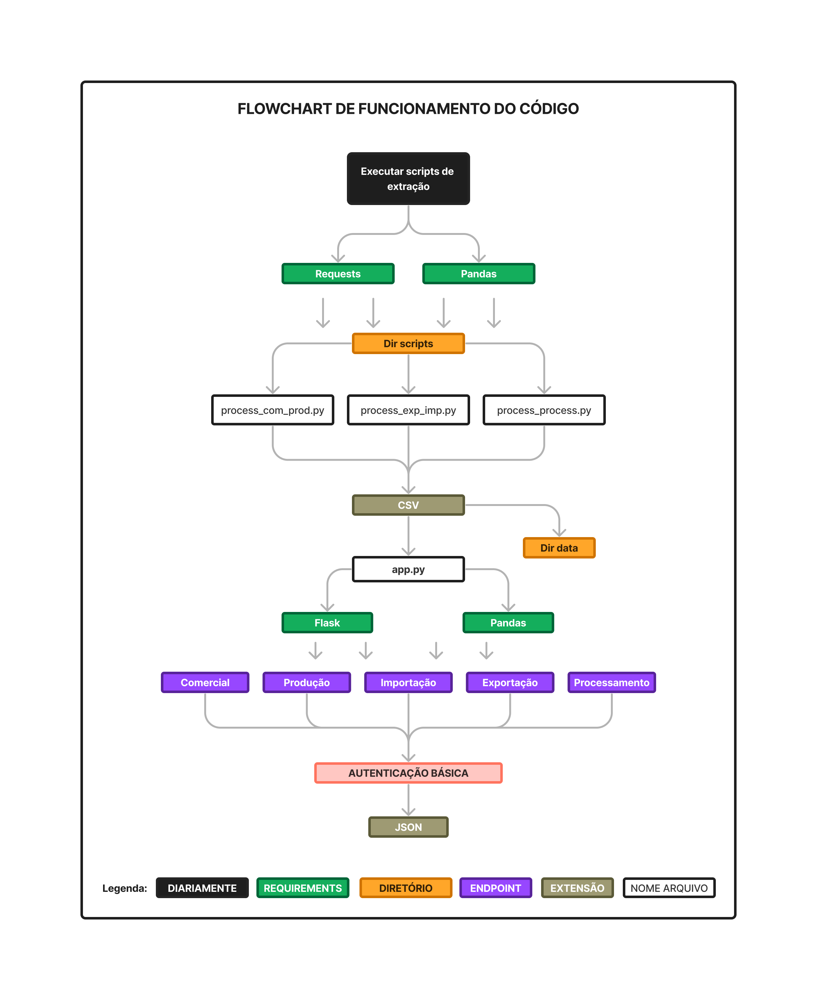
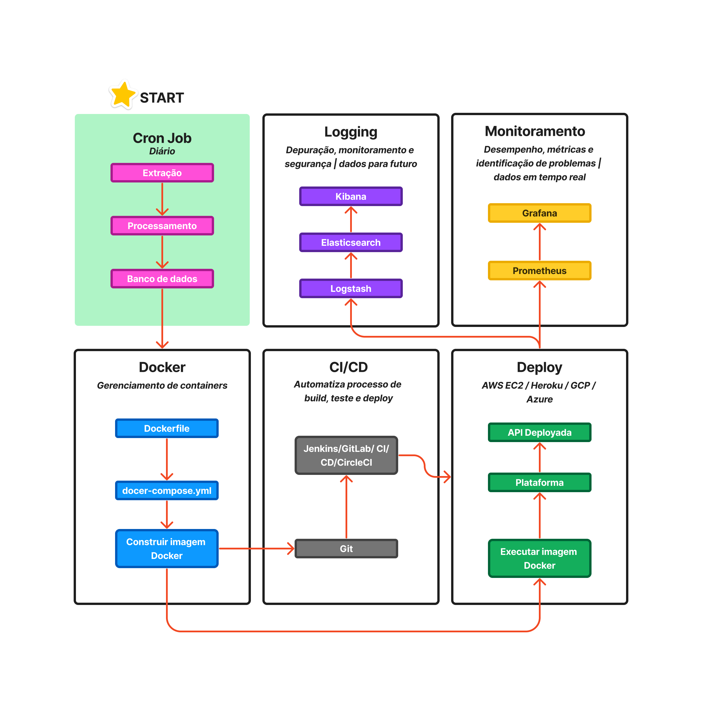

# API de Vitinicultura da EMBRAPA 



Esta API foi desenvolvida para facilitar o acesso e a análise de dados de vitivinicultura provenientes da Embrapa. A API oferece endpoints para consultar dados das seguintes categorias:

* **Produção**: Obter informações sobre a produção de uva em diferentes regiões do Brasil, incluindo ano, quantidade, variedade e controle.
* **Processamento**: Acessar dados sobre o processamento de uva, como tipo de processamento, ano, quantidade, controle e data de processamento.
* **Comercializaçã**o: Consultar informações sobre a comercialização de uva, incluindo ano, tipo de comercialização, quantidade, valor, país de destino e data de comercialização.
* **Importação**: Obter dados sobre a importação de uva, como ano, país de origem, tipo de uva, quantidade, valor e data de importação.
* **Exportação**: Acessar informações sobre a exportação de uva, incluindo ano, país de destino, tipo de uva, quantidade, valor e data de exportação.

**Essa API têm como objetivo:**
* Facilitar o acesso à informação: Esta API torna os dados da Embrapa mais acessíveis para pesquisadores, estudantes, profissionais do setor e qualquer pessoa interessada em vitivinicultura.
* Promover a análise de dados: A API permite que usuários filtrem, agreguem e explorem os dados de forma personalizada, possibilitando a realização de análises aprofundadas e a geração de insights.

**Links Úteis:**
* Site da Embrapa: http://vitibrasil.cnpuv.embrapa.br/index.php?opcao=opt_01
* Flask: https://flask.palletsprojects.com/en/3.0.x/

**Exemplo de Uso:**

Para obter dados de **produção** de uva no ano de 2023, utilize o seguinte endpoint:

```bash
GET api/v1/producao?litros_min=9000&litros_max=20000&ano=2008
```

A resposta da API conterá uma lista de objetos JSON com as seguintes informações:

```json
"[{\"control\":\"derivados_vinho_organico\",\"ano\":2008,\"quantidade_litros\":15000}]"
```

**Observações:**

* A autenticação básica é necessária para acessar este endpoint.
* Os dados de produção são obtidos de arquivos CSV na pasta `data`.
* O endpoint utiliza a biblioteca `pandas` para filtrar e processar os dados.
* O endpoint utiliza a biblioteca `flask_basicauth` para autenticação básica.
* O endpoint utiliza a biblioteca `json` para converter os dados em formato JSON.

**Códigos de Status HTTP:**

* 200 OK: A requisição foi bem sucedida.
* 400 Bad Request: A requisição está incorreta.
* 401 Unauthorized: O usuário não está autorizado a acessar o endpoint.
* 500 Internal Server Error: Ocorreu um erro interno no servidor.

## Endpoint produção

**Objetivo:**

O endpoint `/api/v1/producao` fornece acesso a dados de produção de uva, permitindo filtragem por ano, controle, país, quantidade em litros e quantidade em kg.

**Requisição:**

* **Método:** GET
* **URL:** `/api/v1/producao`
* **Autenticação:** Basic Auth (requer usuário e senha válidos)
* **Parâmetros:**
    * `ano` (opcional): Ano da produção (tipo: inteiro). Valor padrão: None.
    * `control` (opcional): Controle da produção (tipo: string). Valor padrão: None.
    * `litros_min` (opcional): Valor mínimo da quantidade em litros (tipo: inteiro).Valor padrão: None.
    * `litros_max` (opcional): Valor máximo da quantidade em litros (tipo: inteiro). Valor padrão: None.

> Lista com controle de produção:
(
        'vinho_de_mesa', 'vinho_mesa_tinto', 'vinho_mesa_branco',
       'vinho_mesa_rosado', 'vinho_fino_de_mesa__vinifera',
       'vinho_viniferas_tinto', 'vinho_viniferas_branco',
       'vinho_viniferas_rosado', 'suco', 'suco_de_uva_simples',
       'suco_concentrado', 'suco_de_uva_adocado', 'suco_de_uva_organico',
       'suco_de_uva_reconstituido', 'derivados', 'derivados_espumante',
       'derivados_espumante_moscatel', 'derivados_base_espumante',
       'derivados_base_espumante_moscatel',
       'derivados_base_champenoise_champanha',
       'derivados_base_charmat_champanha',
       'derivados_bebida_derivados_uva', 'derivados_polpa_derivados_uva',
       'derivados_mosto_simples', 'derivados_mosto_concentrado',
       'derivados_mosto_derivados_uva_com_bagaco',
       'derivados_mosto_dessulfitado', 'derivados_mistelas',
       'derivados_nectar_derivados_uva', 'derivados_licorosos',
       'derivados_compostos', 'derivados_jeropiga', 'derivados_filtrado',
       'derivados_frisante', 'derivados_vinho_leve',
       'derivados_vinho_licoroso', 'derivados_brandy',
       'derivados_destilado', 'derivados_bagaceira',
       'derivados_licor_derivados_bagaceira', 'derivados_vinagre',
       'derivados_borra_liquida', 'derivados_borra_seca',
       'derivados_vinho_composto', 'derivados_pisco',
       'derivados_vinho_organico', 'derivados_espumante_organico',
       'derivados_destilado_alcoolico_simples_derivados_bagaceira_',
       'derivados_vinho_acidificado_',
       'derivados_mosto_parcialmente_fermentado_',
       'derivados_outros_derivados'
    )

**Resposta:**

* **Formato:** JSON
* **Campos:**

    * `ano`: Ano da produção
    * `control`: Controle de tipos de processo 
    * `quantidade_litros`: Quantidade em litros

**Exemplos de Uso:**

* **Obter dados de produção de todos os anos:**

```bash
GET /api/v1/producao
```

* **Obter dados de produção do ano 2023:**

```bash
GET /api/v1/producao?ano=2023
```

* **Obter dados de produção do ano 2023 do tipo derivados_mosto_simples:**

```bash
GET api/v1/producao?ano=1972&control=derivados_mosto_simples
```

## Endpoint comercial

**Objetivo:**

O endpoint `/api/v1/comercial` fornece acesso a dados de comercialização de uva, permitindo filtragem por ano, controle, quantidade em litros.

**Parâmetros de Entrada:**

* `ano` (opcional): Ano da comercialização (tipo: inteiro). Valor padrão: None.
* `control` (opcional): Controle da comercialização (tipo: string). Valor padrão: None.
* `litros_min` (opcional): Valor mínimo da quantidade em litros (tipo: float). Valor padrão: None.
* `litros_max` (opcional): Valor máximo da quantidade em litros (tipo: float). Valor padrão: None.

**Resposta Esperada:**

A resposta do endpoint é um JSON contendo os seguintes campos:

* `ano`: Ano da comercialização.
* `control`: Controle da comercialização.
* `quantidade_litros`: Quantidade em litros.

**Exemplos de Uso:**

* **Obter dados de comercialização:**

```bash
GET /api/v1/comercial
```

* **Obter dados de comercialização do ano 2023:**

```bash
GET /api/v1/comercial?ano=2023
```

* **Obter dados de comercialização do ano 2023 de vinho de mesa rosado:**

```bash
GET /api/v1/comercial?control=vinho_mesa_rosado&ano=2023
```

* **Obter dados de comercialização de vinho de mesa rosado com quantidade em litros entre 9000 e 200000:**

```bash
GET /api/v1/comercial?control=vinho_mesa_rosado&litros_min=9000&litros_max=200000
```


## Endpoint importação

**Objetivo:**

O endpoint `/api/v1/importacao/<tipo>` fornece acesso a dados de importação de uva, categorizados por tipo (espumante, frescas, passas, suco e vinho). Os dados podem ser filtrados por ano, país, valor em dólar e quantidade em kg.

**Requisição:**

* **Método:** GET
* **URL:** `/api/v1/importacao/<tipo>`
* **Autenticação:** Basic Auth (requer usuário e senha válidos)
* **Parâmetros:**
    * `tipo` (obrigatório): Tipo da importação. Deve ser um dos seguintes:
        * espumante
        * frescas
        * passas
        * suco
        * vinho
    * `ano` (opcional): Ano da importação (tipo: inteiro)
    * `pais` (opcional): País de origem da importação (tipo: string)
    * `dolar_min` (opcional): Valor mínimo em dólar (tipo: float)
    * `dolar_max` (opcional): Valor máximo em dólar (tipo: float)
    * `kg_min` (opcional): Quantidade mínima em kg (tipo: float)
    * `kg_max` (opcional): Quantidade máxima em kg (tipo: float)

**Resposta:**

* **Formato:** JSON
* **Campos:**
    * `tipo`: Tipo da importação
    * `ano`: Ano da importação
    * `pais`: País de origem da importação
    * `valor_dolar`: Valor total da importação em dólar
    * `quantidade_kg`: Quantidade total importada em kg

**Exemplos de Uso:**

* **Obter dados de importação de espumante de todos os anos:**

```bash
GET /api/v1/importacao/espumante
```

* **Obter dados de importação de espumante do ano 2023:**

```bash
GET /api/v1/importacao/espumante?ano=2023
```

* **Obter dados de importação de espumante do ano 2023 originados da Argentina:**

```bash
GET /api/v1/importacao/espumante?ano=2023&pais=argentina
```
* **Obter dados de importação de espumante originados da Argentina, com valor entre 10000 e 20000 dólares:**

```bash
GET /api/v1/importacao/espumante?pais=argentina&dolar_min=10000&dolar_max=20000
```

## Endpoint exportação

**Objetivo:**

O endpoint `/api/v1/exportacao/<tipo>` fornece acesso a dados de exportação de uva, categorizados por tipo (espumante, suco, uva e vinho). Os dados podem ser filtrados por ano, país, valor em dólar e quantidade em kg.

**Requisição:**

* **Método:** GET
* **URL:** `/api/v1/exportacao/<tipo>`
* **Autenticação:** Basic Auth (requer usuário e senha válidos)
* **Parâmetros:**
    * `tipo` (obrigatório): Tipo da exportação. Deve ser um dos seguintes:
        * espumante
        * suco
        * uva
        * vinho
    * `ano` (opcional): Ano da exportação (tipo: inteiro)
    * `pais` (opcional): País de destino da exportação (tipo: string)
    * `dolar_min` (opcional): Valor mínimo em dólar (tipo: float)
    * `dolar_max` (opcional): Valor máximo em dólar (tipo: float)
    * `kg_min` (opcional): Quantidade mínima em kg (tipo: float)
    * `kg_max` (opcional): Quantidade máxima em kg (tipo: float)

**Resposta:**

* **Formato:** JSON
* **Campos:**
    * `tipo`: Tipo da exportação
    * `ano`: Ano da exportação
    * `pais`: País de destino da exportação
    * `valor_dolar`: Valor total da exportação em dólar
    * `quantidade_kg`: Quantidade total exportada em kg

**Exemplos de Uso:**

* **Obter dados de exportação de vinho de todos os anos:**

```bash
GET /api/v1/exportacao/vinho
```

* **Obter dados de exportação de vinho do ano 2023:**

```bash
GET /api/v1/exportacao/vinho?ano=2023
```

* **Obter dados de exportação de vinho do ano 2021 com destino para a França:**

```bash
GET /api/v1/exportacao/vinho?ano=2021&pais=franca
```
* **Obter dados de importação de espumante originados da França, com valor entre 9000 e 20000 quilos:**

```bash
GET /api/v1/exportacao/vinho?kg_min=9000&kg_max=20000&pais=franca
```

## Endpoint processamento

**Objetivo:**

O endpoint `/api/v1/processa/<tipo>` fornece acesso a dados processados de uva, categorizados por tipo (americanas_hibridas, sem_classificacao, uvas_mesa e viniferas). Os dados podem ser filtrados por ano, controle e quantidade em kg.

**Requisição:**

* **Método:** GET
* **URL:** `/api/v1/processa/<tipo>`
* **Autenticação:** Basic Auth (requer usuário e senha válidos)
* **Parâmetros:**
    * `tipo` (obrigatório): Tipo do processamento. Deve ser um dos seguintes:
        * americanas_hibridas
        * sem_classificacao
        * uvas_mesa
        * viniferas
    * `ano` (opcional): Ano do processamento (tipo: inteiro)
    * `control` (opcional): Controle do processamento (tipo: string)
    * `kg_min` (opcional): Quantidade mínima em kg (tipo: float)
    * `kg_max` (opcional): Quantidade máxima em kg (tipo: float)

**Resposta:**

* **Formato:** JSON
* **Campos:**
    * `tipo`: Tipo do processamento
    * `ano`: Ano do processamento
    * `control`: Controle do processamento
    * `quantidade_kg`: Quantidade total processada em kg

**Exemplos de Uso:**

* **Obter dados de processamento de uvas americanas híbridas de todos os anos:**

```bash
GET /api/v1/processa/americanas_hibridas
```

* **Obter dados de processamento de uvas americanas híbridas do ano 2023:**

```bash
GET /api/v1/processa/americanas_hibridas?ano=2023
```

* **Obter dados de processamento de uvas americanas híbridas com valor entre 9000 e 20000 quilos:**

```bash
GET /api/v1/processa/americanas_hibridas?kg_min=9000&kg_max=20000
```

* **Obter dados de processamento de uvas americanas híbridas do tipo tintas oberlin:**

```bash
GET /api/v1/processa/americanas_hibridas?control=tintas_oberlin
```
# Plano de deploy 

1. Cron Job: Inicia diariamente o processo de extração de dados.
2. Scripts de Extração: Baixam, limpam, transformam e normalizam os dados da Embrapa e salvam em arquivos CSV.
3. Processamento de Dados: Formata os dados para armazenamento no banco de dados.
4. Banco de Dados: Armazena os dados processados para acesso pela API.
5. Dockerfile: Define as instruções para construir a imagem Docker da API.
docker-compose.yml: Configura a API e os serviços relacionados, como o banco de dados, em containers Docker.
6. Construir Imagem Docker: Cria a imagem Docker da API.
7. Executar Imagem Docker: Inicia a API em um container Docker.
8. Plataforma de Deploy: Publica a API em uma plataforma cloud (AWS EC2, Heroku, Google Cloud).
9. API Deployada: A API fica disponível online para acesso.

**Monitoramento:**
Prometheus: Coleta dados em tempo real sobre o desempenho da API, permitindo identificar problemas com rapidez.
Grafana: Grafana oferece dashboards personalizados com gráficos e estatísticas, permitindo visualizar os dados do Prometheus de forma clara e completa.

Fornecimento alertas personalizados para métricas específicas, avisando você quando o desempenho da API estiver fora dos limites definidos.

**Logging:**
Logstash: Formata os logs da API e dos serviços relacionados.
Elasticsearch: Armazena os logs em formato estruturado para pesquisa e análise.
Kibana: Visualiza os logs armazenados no Elasticsearch, permitindo filtrar, pesquisar e analisar os logs.


**CI/CD:**
Git: Controle de versão do código-fonte da API e dos scripts de extração.
Jenkins/GitLab CI/CD/CircleCI: Automatiza o processo de build, teste e deploy da API, garantindo que as novas versões sejam liberadas de forma rápida e confiável.


